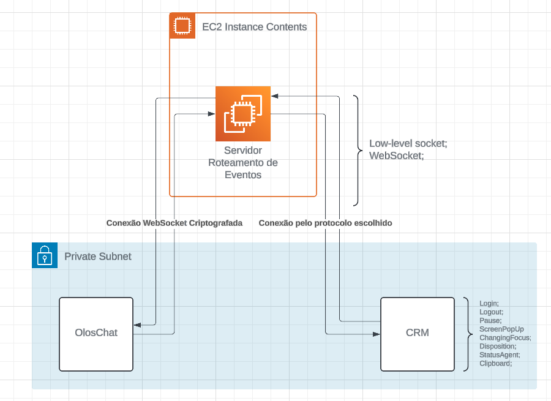

# Introducción

El proyecto de integración entre OlosChat y sistemas CRM, representado por el código proporcionado, tiene como objetivo facilitar la comunicación y el intercambio de datos entre la plataforma de chat OlosChat y los sistemas de gestión de relaciones con clientes (CRM). Este proyecto está desarrollado utilizando TypeScript y diversas tecnologías de comunicación en tiempo real, como WebSockets y sockets de bajo nivel.

La clase principal del proyecto se llama `IntegrationSDK`, que funciona como un kit de desarrollo de software para la integración. Encapsula la lógica necesaria para establecer conexiones con OlosChat y sistemas CRM, así como facilitar el envío de eventos y mensajes entre estos sistemas.

La integración se logra a través de dos métodos principales: mediante WebSockets para la comunicación en tiempo real con OlosChat, y a través de sockets de bajo nivel para la interacción con sistemas CRM. La clase `IntegrationSDK` gestiona ambas conexiones de manera eficiente, permitiendo el envío y la recepción de eventos y datos entre todas las partes involucradas.

El proyecto adopta un enfoque modular, con diferentes entidades y utilidades responsables de tareas específicas, como la lectura de configuraciones, el manejo de conexiones WebSocket y la comunicación con clientes CRM. Además, se implementan mecanismos para gestionar la conexión y desconexión de clientes, así como para garantizar la asignación adecuada de identificadores de agentes.

A través de este proyecto, es posible integrar OlosChat de manera fluida con diversos sistemas CRM, permitiendo una mejor experiencia de usuario y una gestión más eficiente de las relaciones con los clientes.

## ¿Qué es Integration SDK?

Este sistema es una solución integral diseñada para conectar de manera fluida OlosChat, una plataforma de chat versátil, con diversos sistemas de Gestión de Relaciones con Clientes (CRM). Comprende varios componentes clave:

1. **WebSocketToCRM**: Esta clase sirve como puerta de enlace para establecer una conexión WebSocket con el sistema CRM. Gestiona el servidor WebSocket, manejando eventos como el establecimiento de conexión, cierre y errores. Además, proporciona hooks para agregar y eliminar clientes WebSocket, permitiendo que el sistema reaccione dinámicamente a las interacciones de los clientes.

2. **SocketToCRM**: Similar a WebSocketToCRM, esta clase orquesta la configuración de una conexión de socket de bajo nivel con el sistema CRM. Supervisa la creación del servidor de sockets, gestiona eventos como la conexión de clientes y la recepción de datos, y ofrece hooks para agregar y eliminar clientes de socket. Este diseño flexible permite métodos alternativos de comunicación con el sistema CRM, adaptándose a diversos entornos tecnológicos.

3. **OlosTextWebSocket**: Aquí tenemos un componente crucial responsable de gestionar la conexión WebSocket con la plataforma OlosChat. Esta clase maneja los mensajes entrantes de los clientes de OlosChat, los procesa y reenvía los datos relevantes al sistema CRM. Monitorea el servidor WebSocket, reaccionando a eventos como el cierre de conexión y errores, asegurando una comunicación ininterrumpida entre OlosChat y el sistema CRM.

4. **CRMClient**: Esta clase encapsula la representación de un cliente conectado al sistema CRM, independientemente de si la conexión es a través de WebSocket o socket de bajo nivel. Mantiene información esencial del cliente, como índice, conexión de socket e identificador de agente asignado. Al proporcionar métodos para obtener y establecer el identificador de agente, facilita la identificación y gestión fluida de los clientes dentro del sistema de integración.

En conjunto, estos componentes forman un marco robusto para integrar OlosChat con sistemas CRM, permitiendo una comunicación e intercambio de datos eficiente entre ambas plataformas. El diseño modular del sistema y su arquitectura basada en eventos permiten a los desarrolladores ampliar su funcionalidad y adaptarlo a diversos escenarios de integración, garantizando escalabilidad y flexibilidad para satisfacer las necesidades del negocio.

